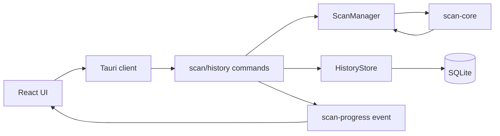
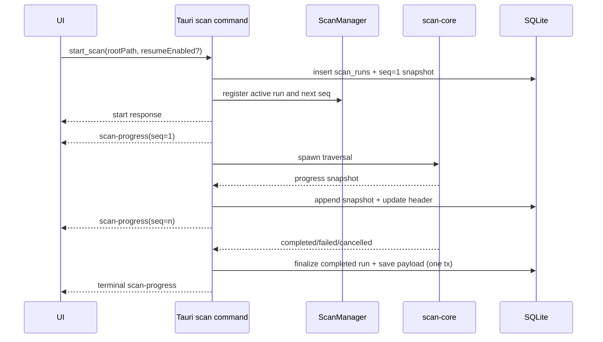

# Scan Run Continuity Architecture

## Status

Draft

## Related artifacts

- Proposal: [2026-04-18-scan-resumption-and-run-clarity-proposal.md](../proposals/2026-04-18-scan-resumption-and-run-clarity-proposal.md)
- Spec: [space-sift-scan-run-continuity.md](../../specs/space-sift-scan-run-continuity.md)
- Active plan context: [2026-04-16-scan-progress-and-active-run-ux.md](../plans/2026-04-16-scan-progress-and-active-run-ux.md)
- Prior scan architecture context: [2026-04-16-fast-safe-scan-architecture.md](../plans/2026-04-16-fast-safe-scan-architecture.md)
- Governing rules: [AGENTS.md](../../AGENTS.md), [.codex/CONSTITUTION.md](../../.codex/CONSTITUTION.md)

## Summary

Space Sift currently treats scan progress as in-memory live state and completed scans as durable history rows. The new continuity contract requires those two modes to stay distinct: live scans must remain fast and event-driven, while resumability, stale-run recovery, deterministic snapshot ordering, and retention must be backed by additive SQLite persistence. The proposed design keeps the existing completed scan history model intact, adds append-only scan run tables in the same local SQLite database, makes the latest persisted snapshot the authoritative run state, and exposes a run-oriented read model for recovery and resume without turning the scanner into a background queue or daemon.

## Requirements covered

| Requirement | Design area |
| --- | --- |
| `R1` lifecycle continuity | `scan_runs` header row plus append-only `scan_run_snapshots` rows |
| `R2` deterministic ordering | per-run `seq`, `(run_id, seq)` primary key, indexed latest-snapshot reads |
| `R3` bounded progress metrics | additive snapshot fields, rate calculation at write time, validation in repository layer |
| `R4` heartbeat and staleness | command-owned heartbeat timer, authoritative snapshot liveness, synthetic stale snapshots |
| `R5` crash/shutdown continuation | startup reconciler with explicit precedence, synthetic `STALE`/`ABANDONED` snapshots, audit log |
| `R6` optional resumability | per-run `resume_enabled`, resume token/payload columns, child-run resume flow |
| `R7` privacy/retention | additive schema with no file contents, purge job, safe audit records |
| `R8` API and UX consistency | new run read commands/types, additive scan-progress fields, existing history APIs preserved |
| `R9` failure handling | transactional snapshot writes, terminal best-effort fallback, immutable prior snapshots |
| `R10` migration compatibility | additive tables, no rewrite of legacy `scan_history`, fallback readers |

## Current architecture context

The current scan path has five relevant pieces:

1. `scan-core` performs the actual traversal and emits `ScanStatusSnapshot` progress callbacks during execution.
2. `ScanManager` in [mod.rs](/D:/Data/20260415-space-sift/src-tauri/src/state/mod.rs) keeps only one in-memory active scan plus the latest live snapshot.
3. `start_scan`, `cancel_active_scan`, and `get_scan_status` in [scan.rs](/D:/Data/20260415-space-sift/src-tauri/src/commands/scan.rs) expose that live state and emit the `scan-progress` Tauri event.
4. `HistoryStore` in [lib.rs](/D:/Data/20260415-space-sift/src-tauri/crates/app-db/src/lib.rs) persists only completed scan payloads in `scan_history`, plus duplicate-hash and cleanup data.
5. The React client in [tauriSpaceSiftClient.ts](/D:/Data/20260415-space-sift/src/lib/tauriSpaceSiftClient.ts) subscribes to `scan-progress` and separately loads completed scan history.

Important existing constraints:

- One active scan at a time is enforced in memory.
- Completed scan history is SQLite-backed and local-only.
- `scan_id` is already a UUID v4 and is the externally visible identifier throughout Rust and TypeScript.
- The UI already distinguishes active scans from completed results, but it cannot recover a run after restart because no in-progress state is durable.
- The prior scan architecture intentionally kept ordinary scans metadata-first and read-only. This design must preserve that boundary.

## Proposed architecture

### Design direction

Keep the current live execution path, but make it write through an additive run repository:

- `scan-core` stays responsible for discovery, bounded progress, and cancellation-aware traversal.
- `ScanManager` stays responsible for one active in-memory run and for coordinating cancellation.
- `HistoryStore` grows a scan-run repository surface for durable run headers, snapshots, reconciliation, purge, and resume metadata.
- Tauri commands gain a run-oriented read/write API for continuity and recovery.
- The existing `scan_history` table remains the source of truth for completed explorer payloads.

### Canonical identity

To minimize churn, the architecture reuses the existing external `scan_id` as the canonical `run_id`.

- Rust backend code may keep field names like `scan_id` where already established.
- New persistence tables may use `run_id` internally, but the value is the same UUID already exposed as `scanId` in TypeScript.
- Resume creates a new UUID and links it to `resumed_from_run_id`; the original run remains immutable after it becomes stale or terminal.

### Components and responsibilities

| Component | Responsibility |
| --- | --- |
| `scan-core` | emit bounded activity snapshots from real traversal progress and stay read-only/cancellation-aware |
| `ScanManager` | own live active handle, next `seq`, last persisted counters, last activity timestamp, cancellation flag |
| `HistoryStore` scan-run methods | append snapshots, mirror latest state into run header, finalize completion atomically, reconcile stale runs, purge expired rows, validate counters |
| Tauri scan commands | translate live scan events into persisted run snapshots, own the heartbeat timer lifecycle, and expose run/resume commands |
| Tauri history commands | keep completed history commands unchanged; add run continuity commands separately |
| React client | continue using `scan-progress` for live updates, add run recovery views via explicit commands |
| Startup reconciler | on app boot, mark old `RUNNING` rows as `STALE` or `ABANDONED` and record audit events |

### High-level component diagram

## Data model and data flow

### Storage model

The design adds three tables and preserves the existing `scan_history` table.

#### `scan_runs`

One row per run, used for fast list/read queries and reconciliation.

- `run_id TEXT PRIMARY KEY`
- `root_path TEXT NOT NULL`
- `target_id TEXT NOT NULL`
- `status TEXT NOT NULL`
- `started_at TEXT NOT NULL`
- `last_snapshot_at TEXT NOT NULL`
- `last_progress_at TEXT NOT NULL`
- `latest_seq INTEGER NOT NULL`
- `stale_since TEXT NULL`
- `terminal_at TEXT NULL`
- `completed_scan_id TEXT NULL`
- `resumed_from_run_id TEXT NULL`
- `resume_enabled INTEGER NOT NULL DEFAULT 0`
- `resume_token TEXT NULL`
- `resume_expires_at TEXT NULL`
- `resume_payload_json TEXT NULL`
- `resume_target_fingerprint_json TEXT NULL`
- `privacy_scope_id TEXT NULL`
- `error_code TEXT NULL`
- `error_message TEXT NULL`
- `created_at TEXT NOT NULL`
- `updated_at TEXT NOT NULL`

Indexes:

- `idx_scan_runs_status_last_snapshot` on `(status, last_snapshot_at)`
- `idx_scan_runs_started_at` on `(started_at DESC)`
- `idx_scan_runs_resumed_from` on `(resumed_from_run_id)`

Notes:

- `scan_runs.status` is a denormalized mirror of the latest persisted snapshot status and MUST always match it.
- `last_progress_at` advances only on activity snapshots emitted from real traversal progress. Heartbeat snapshots update `last_snapshot_at` but do not advance `last_progress_at`.
- `target_id` remains the stable user-facing scan target discriminator required by the spec.
- `resume_target_fingerprint_json` stores the deterministic resume guard for `TARGET_CHANGED`.
- `privacy_scope_id` stores the deterministic resume guard for `PRIVACY_SCOPE_MISMATCH`. For the first implementation this is a single explicit scope constant such as `local-default-v1`, not an inferred runtime guess.

#### `scan_run_snapshots`

Append-only ordered progress snapshots.

- `run_id TEXT NOT NULL`
- `seq INTEGER NOT NULL`
- `snapshot_at TEXT NOT NULL`
- `status TEXT NOT NULL`
- `files_discovered INTEGER NOT NULL`
- `directories_discovered INTEGER NOT NULL`
- `items_discovered INTEGER NOT NULL`
- `items_scanned INTEGER NOT NULL`
- `errors_count INTEGER NOT NULL`
- `bytes_processed INTEGER NOT NULL`
- `scan_rate_items_per_sec REAL NOT NULL`
- `progress_percent REAL NULL`
- `current_path TEXT NULL`
- `message TEXT NULL`
- primary key `(run_id, seq)`
- foreign key `run_id -> scan_runs(run_id)`

Notes:

- `items_scanned` is stored explicitly even though the current scan engine can initially map it to `files_discovered + directories_discovered`.
- `seq` is the authoritative order key. `snapshot_at` is retained for UI display, stale calculation, and legacy fallback.
- `status` is authoritative for run-state history. Reconciliation transitions such as `STALE` and `ABANDONED` are appended as synthetic snapshots rather than being stored only in the header row.

#### `scan_run_audit`

Small append-only operational record for recovery, purge, and resume rejection reasons.

- `event_id INTEGER PRIMARY KEY AUTOINCREMENT`
- `run_id TEXT NULL`
- `event_type TEXT NOT NULL`
- `reason_code TEXT NOT NULL`
- `created_at TEXT NOT NULL`
- `details_json TEXT NULL`

### Why the existing `scan_history` table stays

`scan_history` currently stores the full completed result JSON that the explorer, duplicate flow, and cleanup flow already depend on. Replacing it would create unnecessary migration risk. The new design therefore uses:

- `scan_runs` and `scan_run_snapshots` for continuity and recovery
- `scan_history` for completed result reopening

On successful completion the backend writes both:

1. a terminal run snapshot plus final run header update
2. the existing `scan_history` payload

These writes happen in one SQLite transaction. If that transaction fails, no `COMPLETED` snapshot is committed. The backend then attempts a separate best-effort finalization that appends a `FAILED` snapshot with an explicit persistence error code so the run never exposes contradictory terminal history.

### Data flow

## Control flow

### Start a new run

1. `start_scan` validates root path and enforces the current one-scan-at-a-time rule.
2. The command creates a new UUID, inserts a `scan_runs` row, and inserts `seq = 1` as the initial snapshot in one transaction.
3. `ScanManager` stores the active handle, next sequence number, and last-activity timestamp for the new run.
4. The command starts a heartbeat timer owned outside `scan-core` so heartbeat emission can continue even when traversal is blocked in a long filesystem call.
5. The command emits the initial `scan-progress` event and then spawns `scan-core`.

### Persist progress and heartbeat

1. `scan-core` emits activity snapshots only when traversal thresholds are met.
2. A command-owned heartbeat timer wakes every `heartbeat_interval_seconds` and checks whether a persisted activity snapshot has been observed recently for the active run.
3. If no recent activity snapshot exists, the timer emits a heartbeat snapshot that repeats the last known counters and path with a new `seq` and `snapshot_at`.
4. The command layer converts either activity or heartbeat updates into the persisted snapshot row shape and asks `HistoryStore` to append them.
5. `HistoryStore` validates monotonic counters and the next expected `seq`.
6. On success it updates `scan_runs.latest_seq`, `last_snapshot_at`, and `scan_runs.status` in the same transaction.
7. The command emits the same snapshot to the UI.

### Terminal completion

1. Completion calls a dedicated `HistoryStore.finalize_completed_run(...)` path rather than reusing the ordinary append-snapshot path.
2. That finalization opens one SQLite transaction that:
   - appends the `COMPLETED` snapshot with the next `seq`
   - updates `scan_runs.status`, `latest_seq`, `last_snapshot_at`, and `completed_scan_id`
   - inserts the completed payload into `scan_history`
3. Only after the transaction commits does the backend emit the terminal `scan-progress` event and clear the in-memory active handle.
4. If the transaction fails, the backend attempts a best-effort fallback transaction that appends a `FAILED` snapshot with a stable persistence error code such as `HISTORY_PERSISTENCE_FAILED`.

### Crash and startup reconciliation

1. App startup calls `HistoryStore.reconcile_scan_runs(now)` before commands become available.
2. Reconciliation evaluates runs in strict precedence order and appends at most one synthetic snapshot per run per startup pass.
3. If the latest snapshot is `RUNNING` and `last_snapshot_at >= abandon_after_hours`, append `ABANDONED`.
4. Else if the latest snapshot is `RUNNING` and `last_snapshot_at >= heartbeat_stale_after_seconds`, append `STALE`.
5. Else if the latest snapshot is `STALE` and `last_snapshot_at >= abandon_after_hours`, append `ABANDONED`.
6. Each reconciliation action updates the header mirror and writes a `scan_run_audit` row with reason code in the same transaction.
7. No run is auto-resumed unless `resume_enabled = true` and the resume preconditions still pass.

### Cancel stale or recovered run

1. `cancel_scan_run(runId)` first loads the latest persisted snapshot for that run.
2. If the run does not exist, return `404`.
3. If the run matches the current in-memory active run, delegate to `cancel_active_scan()` and let the live worker emit the terminal `CANCELLED` snapshot.
4. If the latest persisted status is `STALE` or `ABANDONED`, append a synthetic `CANCELLED` snapshot with the next `seq`, mirror the header update, and write a cancellation audit row in one transaction.
5. If the latest status is already terminal, return `409` rather than silently appending another terminal row.
6. First-pass non-live cancellation does not emit a Tauri event; the client refreshes run state by command response plus explicit refetch.

### Resume flow

1. UI reads a recoverable run from `open_scan_run`.
2. User triggers `resume_scan_run(runId)`.
3. Backend validates:
   - `resume_expires_at` is still in the future, otherwise `TOKEN_EXPIRED`
   - `resume_target_fingerprint_json` still matches the current normalized root path, root classification, and traversal-affecting option/exclusion hash, otherwise `TARGET_CHANGED`
   - `privacy_scope_id` matches the current app privacy scope constant, otherwise `PRIVACY_SCOPE_MISMATCH`
4. Backend creates a new child run row linked by `resumed_from_run_id`.
5. Resume payload is used only to seed the new run. The old run remains unchanged except for any audit row about the resume action.

## Interfaces and contracts

### Existing contracts preserved

- `list_scan_history` and `open_scan_history` stay focused on completed scans.
- `scan-progress` remains the live event channel.
- The external identifier remains `scanId`.

### Additive live snapshot fields

`ScanStatusSnapshot` should gain additive fields so live UI and persisted preview use the same event shape where practical:

- `seq: number | null`
- `snapshotAt: string | null`
- `scanRateItemsPerSec: number | null`
- `itemsDiscovered: number | null`
- `itemsScanned: number | null`
- `errorsCount: number | null`

The existing fields should remain for compatibility with current UI and tests.

### New run-oriented types

- `ScanRunStatus = "running" | "stale" | "abandoned" | "completed" | "cancelled" | "failed"`
- `ScanRunHeader`
- `ScanRunSnapshot`
- `ScanRunSummary`
- `ScanRunDetail`
- `ResumeScanEligibility`

These types belong in the TypeScript shared contract and the Rust command payloads. They are distinct from the current narrow live-only `ScanStatusSnapshot`.

Read-model invariant:

- `ScanRunHeader.status` MUST equal `ScanRunDetail.latestSnapshot.status`.
- `ScanRunHeader.latestSeq` MUST equal `ScanRunDetail.latestSnapshot.seq`.
- Reconciliation-created `STALE` and `ABANDONED` transitions appear in both the ordered snapshot history and the header mirror.
- `cancel_scan_run` appends `CANCELLED` only for non-terminal persisted runs and returns `409` for already-terminal runs.

### New Tauri commands

- `list_scan_runs() -> ScanRunSummary[]`
- `open_scan_run(runId: string, page?: number, pageSize?: number) -> ScanRunDetail`
- `resume_scan_run(runId: string) -> { runId: string }`
- `cancel_scan_run(runId: string) -> void`

Additive change to existing command:

- `start_scan(rootPath: string, options?: { resumeEnabled?: boolean })`

Compatibility rule:

- `cancel_active_scan()` remains for the current active in-memory run.
- `cancel_scan_run(runId)` is for stale or recovered rows and for unifying UI actions around a specific run record.

## Failure modes

| Failure mode | Handling |
| --- | --- |
| snapshot insert fails during active run | mark run failed if possible, emit terminal error snapshot best effort, keep previous snapshots |
| completion payload write fails | the atomic finalization transaction is rolled back; backend then attempts a `FAILED` fallback finalization with explicit error code and never publishes `COMPLETED` first |
| app exits mid-run | startup reconciliation marks `STALE` or `ABANDONED`; no silent deletion |
| resume token invalid or expired | reject resume, write audit row with reason code, original run unchanged |
| counter regression or `seq` gap | repository rejects write, scan command treats as unrecoverable and fails the run |
| traversal blocks long enough that no activity snapshot is emitted | command-owned heartbeat timer still emits liveness updates using last known counters, avoiding false `STALE` transitions for healthy runs |
| retention purge races with UI read | purge only terminal runs older than policy; active or stale recoverable rows are excluded |

## Security and privacy design

- No file contents, file hashes, or in-memory buffers are stored in run snapshots.
- `current_path` remains the only path-like progress field, and may be redacted later by config without schema changes.
- Resume data uses the same local-trust model as current scan history: SQLite at rest on the local machine, no cloud sync, and no checked-in secrets.
- `resume_payload_json` must contain only restart-safe traversal state and target fingerprint material, not copied directory entries or file bodies.
- `resume_token` is an opaque local identifier, not an authentication secret.
- `resume_target_fingerprint_json` is a structured digest over normalized root path, root class, and traversal-affecting options/exclusions only; it must not include volatile counters or file contents.
- `privacy_scope_id` is explicit and versioned so `PRIVACY_SCOPE_MISMATCH` is deterministic even before the product exposes multiple privacy modes.
- Audit rows and structured logs must use stable reason codes and avoid embedding arbitrary user path lists beyond the current run root when possible.

## Performance and scalability

- Snapshot writes are bounded by the existing activity cadence plus one heartbeat every 30 seconds, so the design does not reintroduce per-file event spam.
- List screens read from `scan_runs` and the latest indexed snapshot instead of scanning full JSON payloads.
- `scan_history` writes remain unchanged and occur only on successful completion.
- Snapshot preview pagination prevents long run histories from loading every row into the UI at once.
- The schema remains intentionally single-user and local. No multi-process writer model is introduced in this iteration.

## Observability

For this repository, observability should stay local and explicit rather than inventing a remote telemetry stack.

- Structured application logs:
  - `scan_run_snapshot_write_failed`
  - `scan_run_finalization_failed`
  - `scan_run_no_progress_warning`
  - `scan_run_reconciled`
  - `scan_run_resume_rejected`
  - `scan_run_purged`
- Audit table rows for reconciliation, purge, and resume rejection reasons
- Repository-level invariants covered by tests:
  - contiguous `seq`
  - `scan_runs.status == latest snapshot.status`
  - `scan_runs.latest_seq == latest snapshot.seq`
  - non-decreasing counters
  - stale reconciliation timing
  - completed runs are reopenable from `scan_history` whenever latest status is `COMPLETED`
  - immutable original run on resume
- UI debug surface:
  - run detail screen can show `status`, `latestSeq`, `lastSnapshotAt`, `lastProgressAt`, `staleSince`, and `canResume`

Heartbeat meaning:

- A heartbeat proves the run coordinator is alive and still owns the active run; it does not by itself prove counters are advancing.
- If `last_progress_at` remains unchanged for four consecutive heartbeat intervals, emit `scan_run_no_progress_warning` and surface the stale duration in the debug/read model without forcing terminal failure.

## Compatibility and migration

### Migration strategy

- Add the new tables via `CREATE TABLE IF NOT EXISTS`.
- Do not rewrite or backfill existing `scan_history` rows during initial rollout.
- Treat old completed scans as history-only rows with no run continuity record.
- Keep all new columns additive and nullable where backward compatibility requires it.

### Runtime compatibility

- Older app versions will ignore the new tables and continue to read `scan_history`.
- Newer versions must continue to reopen legacy completed scans that have no continuity metadata.
- New run continuity APIs should degrade cleanly to "no recoverable runs" on databases created by older versions.

### Downgrade posture

Because the new design is additive and does not mutate `scan_history`, a downgrade loses continuity features but not completed-scan history access. That is the intended rollback boundary.

## Alternatives considered

### Alternative A: store only the latest run snapshot in `scan_runs`

Rejected because it does not satisfy ordered snapshot preview, makes sequence validation impossible, and weakens auditability around stale transitions.

### Alternative B: persist all continuity data inside the existing `scan_history.scan_json`

Rejected because `scan_history` is terminal-result storage today. Overloading it with in-progress rows would blur the completed-result contract, complicate duplicate and cleanup flows, and make startup reconciliation awkward.

### Alternative C: make resume mutate the original run in place

Rejected because it destroys the original failure/stale timeline, makes audit history less clear, and conflicts with the spec requirement that resume create a new child run.

## ADRs

- Proposed ADR: [2026-04-18-scan-run-persistence-and-resume.md](../adr/2026-04-18-scan-run-persistence-and-resume.md)

Decisions captured there:

- additive SQLite tables in the existing app database
- completed scan history kept as-is
- child-run resume model

## Risks and mitigations

| Risk | Mitigation |
| --- | --- |
| dual-write divergence between continuity rows and completed scan payloads | finalize completion in one SQLite transaction and never publish `COMPLETED` before commit |
| excessive SQLite writes on very large scans | reuse bounded scan-core cadence and add heartbeat only when quiet |
| false stale transitions during blocking filesystem work | own heartbeat generation in the command layer instead of `scan-core` |
| stale-run UI confusion | separate `ScanRunStatus` from live scan lifecycle and expose explicit `canResume` / `canCancel` flags |
| brittle resume payload tied too closely to current traversal internals | keep resume disabled by default, scope payload to minimal restart-safe cursor data, and validate with an explicit fingerprint contract |
| future schema growth in `HistoryStore` becoming unwieldy | add focused scan-run repository methods inside `app-db` without changing the current external crate boundary yet |

## Planning defaults

- `open_scan_run` default snapshot preview page size is `20`.
- The start-scan UI surfaces `resume_enabled` as an advanced checkbox, collapsed by default and off by default.
- `ABANDONED` is shown as an explicit badge in run summaries/details in the first implementation; no dedicated filter is added yet.
- First-pass non-live cancellation uses command-response plus explicit refresh rather than a new Tauri event.

## Readiness

This design is ready for execution planning and a matching test spec. Implementation should still wait for `plan-review` and `test-spec` before code changes.
