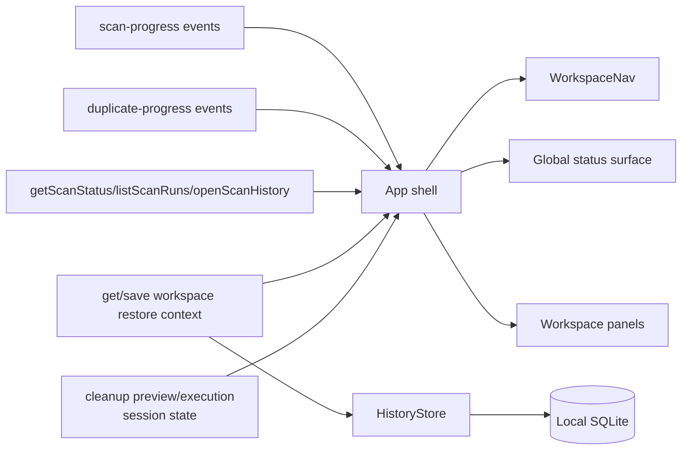
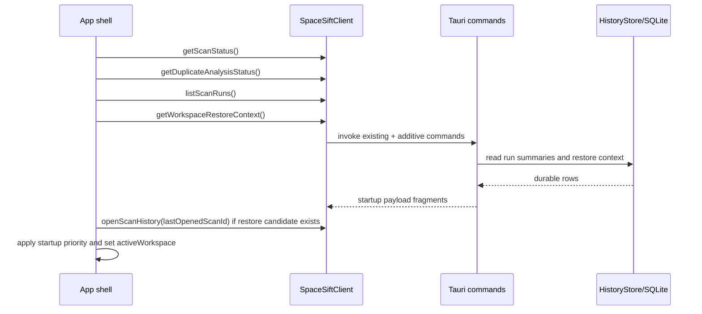

# Workspace Navigation UI Architecture

## Status

approved

## Related artifacts

- Proposal: [2026-04-22-space-sift-advanced-ui-upgrade.md](../proposals/2026-04-22-space-sift-advanced-ui-upgrade.md)
- Spec: [space-sift-workspace-navigation.md](../../specs/space-sift-workspace-navigation.md)
- Project map: [project-map.md](../project-map.md)
- Related approved architecture: [2026-04-18-scan-run-continuity.md](./2026-04-18-scan-run-continuity.md)
- Active plan context: [plan.md](../plan.md)
- Governing workflow note: [workflows.md](../workflows.md)
- Governing rules: [AGENTS.md](../../AGENTS.md), [CONSTITUTION.md](../../CONSTITUTION.md)

## Summary

The workspace-navigation change stays frontend-first, but it still needs one
small persistence and command-surface addition so startup restoration is
explicit instead of guessed. The design keeps `App.tsx` as the first-pass app
shell boundary, adds shell-owned workspace navigation and global-status models,
stores a minimal local SQLite-backed workspace restore context in the existing
app database, and exposes that context through two additive Tauri commands in
the shell command module. Existing scan, history, duplicate, cleanup, and
continuity contracts remain in force. The shell derives startup choice, global
status, and next-safe-action priority from existing live and durable state
instead of inventing a new backend orchestration API, and it remains
operation-aware so stale command replies or repeated terminal events do not
override fresher review state.

## Requirements covered

| Requirement | Design area |
| --- | --- |
| `R1`-`R5` shell shape | app-shell-owned workspace state, `WorkspaceNav`, global status surface, panel boundaries |
| `R6`-`R10` startup behavior | validated restore context, startup resolver, degraded Explorer reopening, Overview fallback |
| `R11`-`R18` automatic navigation | `navigateWorkspace(target, reason, operationId?)`, allowed auto-switch set, operation-aware dedupe |
| `R19`-`R24` feature boundary preservation | loaded-scan ownership, session-scoped duplicate and cleanup review state, no durable duplicate or cleanup-preview restore |
| `R25`-`R26a` accessibility | single selected workspace model, `tablist` semantics, vertical-orientation support, panel association |
| `O1`-`O8a` observability and testability | shell-level status model, restoration notices, named navigation and next-action test seams |
| `C3`-`C6` compatibility | additive SQLite table, additive commands, no backfill, safe downgrade to manual navigation |
| security and privacy rules | local-only restore context, no destructive shell action, no resume token or preview payload storage |

## Current architecture context

The current product already has the domain workflows that the workspace shell
must coordinate:

1. [App.tsx](/D:/Data/20260415-space-sift/src/App.tsx) is the single React
   orchestration boundary for scan start and monitoring, history reopen, result
   exploration, duplicate review, cleanup preview and execution, and safety
   messaging.
2. [spaceSiftClient.ts](/D:/Data/20260415-space-sift/src/lib/spaceSiftClient.ts)
   and
   [tauriSpaceSiftClient.ts](/D:/Data/20260415-space-sift/src/lib/tauriSpaceSiftClient.ts)
   already define the typed frontend-to-Tauri contract surface.
3. [state/mod.rs](/D:/Data/20260415-space-sift/src-tauri/src/state/mod.rs)
   keeps live scan state, live duplicate-analysis state, and latest cleanup
   preview or execution in memory only.
4. [lib.rs](/D:/Data/20260415-space-sift/src-tauri/crates/app-db/src/lib.rs)
   keeps durable local SQLite data for completed scan history, continuity run
   history, duplicate hash cache, and cleanup execution history.
5. [history.rs](/D:/Data/20260415-space-sift/src-tauri/src/commands/history.rs)
   exposes completed-history reopen and run-continuity reads, while
   [shell.rs](/D:/Data/20260415-space-sift/src-tauri/src/commands/shell.rs)
   currently exposes only Explorer handoff.

Important existing constraints:

- Completed scan reopening is durable through `scan_history` and remains the
  source of truth for the scan payload that Explorer, Duplicates, and Cleanup
  consume.
- Duplicate-analysis results are session-scoped in `DuplicateManager` and are
  not currently persisted to SQLite.
- Cleanup previews are session-scoped in `CleanupManager`; cleanup execution
  results are durable in SQLite, but there is no current read command that
  rehydrates them into shell state at startup.
- The repository constitution requires persistent app data to remain local and
  SQLite-backed unless a later approved artifact changes that posture.
- `docs/workflows.md` already requires Tauri command-plus-event flows to avoid
  letting awaited command responses overwrite fresher event snapshots or reset
  review state on repeated terminal events.

Implication:

- The workspace shell cannot satisfy the approved startup-restoration contract
  with frontend-only memory or `localStorage`.
- The first slice must add only the minimum durable shell context:
  validated last workspace and last opened completed scan identity.

## Proposed architecture

### Design direction

Keep the current domain features and the current `SpaceSiftClient` boundary, and
add a thin app-shell layer that coordinates them:

- `App.tsx` remains the first-pass orchestration boundary.
- No new global state-management library is introduced.
- The app shell owns workspace selection, startup restoration, shell-level
  notices, global status, next-safe-action selection, and contractual
  auto-switch dispatch.
- Feature workspaces keep their local review and control state.
- The backend gains only one small durable shell-state record and two additive
  commands to read and write it.

### Component and responsibility boundaries

| Component | Responsibility |
| --- | --- |
| App shell in `App.tsx` | own `activeWorkspace`, loaded completed scan, startup bootstrap, global status model, next-safe-action selection, restore-context writes, and contractual auto-switch dispatch |
| `WorkspaceNav` and `WorkspacePanel` UI layer | render accessible top-level navigation, selected state, panel association, and manual workspace activation |
| Overview workspace | summarize active work, loaded scan context, interrupted runs, and the shell-selected next safe action |
| Scan workspace | own scan form inputs, running-scan controls, and active-scan messaging |
| History workspace | own history filtering, completed-scan reopen actions, and interrupted-run review actions |
| Explorer workspace | own current path, breadcrumb, and sort state for the loaded scan |
| Duplicates workspace | own disclosure state, keep selections, and duplicate review messaging |
| Cleanup workspace | own source selection, preview review state, execution state, and permanent-delete confirmation |
| Safety workspace | own static safety guidance and explicit navigation links |
| `SpaceSiftClient` additions | read and write the durable workspace restore context |
| `commands::shell` | expose shell-owned restore-context commands and Explorer handoff |
| `HistoryStore` | persist and validate the single restore-context record in the same SQLite database as other durable local app state |

### State ownership

The app shell owns:

- `activeWorkspace`
- the loaded completed scan that Explorer, Duplicates, and Cleanup consume
- `workspaceRestoreContext`
- startup workspace resolution
- global status model
- next safe action selection
- contractual auto-switch dispatch
- the operation-aware ledger that prevents stale or repeated events from
  re-running the same workspace switch

Feature workspaces own local review state:

- Scan owns scan form state and active-scan controls.
- History owns history filters and interrupted-run row actions.
- Explorer owns current browsed path, breadcrumbs, and sort state.
- Duplicates owns disclosure state and keep selections.
- Cleanup owns source selection, preview state, execution state, and
  permanent-delete confirmation.
- Safety owns static guidance and explicit navigation links.

The first implementation slice MUST NOT introduce a new global state library
and MUST NOT rewrite feature workflows. `App.tsx` remains the orchestration
boundary while the shell, navigation control, and workspace panels are added
incrementally.

### Backend and persistence ownership

The shell owns the meaning of persisted workspace restoration. Feature tabs do
not infer cold-start restoration from their own session-only state.

- `HistoryStore` grows `load_workspace_restore_context()` and
  `save_workspace_restore_context(...)`.
- `commands::shell` grows `get_workspace_restore_context` and
  `save_workspace_restore_context`.
- `src-tauri/src/lib.rs` registers those commands additively alongside the
  existing command surface.
- `DuplicateManager` and `CleanupManager` remain session-scoped in this slice.
  They are not upgraded to durable restart restoration by this design.

### Shell data-source diagram

## Data model and data flow

### Durable storage model

The design adds one additive SQLite table in the existing app database:

`workspace_restore_context`

Minimum durable fields:

- `schema_version INTEGER NOT NULL`
- `last_workspace TEXT NOT NULL`
- `last_opened_scan_id TEXT NULL`
- `updated_at TEXT NOT NULL`

Notes:

- The table stores one logical record for the local app profile. The exact
  SQLite singleton-key mechanism is an implementation detail.
- `last_opened_scan_id` is nullable because `Overview`, `Scan`, `History`, and
  `Safety` do not require a loaded completed scan identity.
- The record does not store duplicate-analysis result IDs, cleanup-preview IDs,
  cleanup candidate lists, resume tokens, or filesystem paths.
- If `schema_version` is missing, unreadable, or unsupported,
  `get_workspace_restore_context` MUST treat the row as invalid and behave as
  though no restore context exists.
- Validation is behavioral, not relational: the shell attempts to reopen
  `last_opened_scan_id` through the existing durable history contract instead of
  trusting the raw identifier blindly.

### Restore-context write rules

- The shell writes `last_workspace` after:
  - manual workspace activation
  - an approved contractual auto-switch
- The shell writes `last_opened_scan_id` only after a completed scan has been
  successfully opened from durable history, including the reopen step that
  follows successful scan completion persistence.
- The shell SHOULD skip redundant writes when neither `last_workspace` nor
  `last_opened_scan_id` changed.

### Startup data flow

At app startup, the shell resolves initial state from existing contracts rather
than from a new backend bootstrap API:

1. Load in parallel:
   - `getScanStatus()`
   - `getDuplicateAnalysisStatus()`
   - `listScanRuns()`
   - `getWorkspaceRestoreContext()`
2. If restore context exists and names `Explorer` with a non-null
   `lastOpenedScanId`, validate it with `openScanHistory(lastOpenedScanId)`.
3. Build startup candidates using the approved spec priority:
   - running scan
   - running duplicate analysis tied to the current loaded scan
   - interrupted runs (`STALE` or `ABANDONED`)
   - validated Explorer restore context
   - otherwise Overview
4. If validation fails, show a non-blocking shell notice and fall back safely.

Current-slice constraint:

- Because duplicate-analysis results and cleanup previews remain session-scoped,
  cold startup does not restore `Duplicates` or `Cleanup`.
- The resolver still checks live duplicate status for spec compatibility, but on
  a real cold restart that branch is expected to be ineligible unless a future
  approved change makes duplicate review durable across restart.

### Global status data flow

The shell derives the global status surface from already available data:

- live scan status from `getScanStatus()` plus `scan-progress`
- live duplicate-analysis status from `getDuplicateAnalysisStatus()` plus
  `duplicate-progress`
- interrupted-run presence from `listScanRuns()`
- loaded completed scan from `openScanHistory(...)`
- cleanup preview ready and cleanup execution completed from existing frontend
  session state after preview or execution actions succeed

The shell does not introduce a new backend "global status" command. It computes
the primary label, context summary, and next safe action locally so the feature
contracts remain composed rather than duplicated.

## Control flow

### Startup resolution

### Manual navigation

1. User activates a workspace through the navigation control.
2. The shell updates `activeWorkspace`.
3. The shell persists `last_workspace`.
4. Manual navigation never starts scan, duplicate analysis, cleanup preview,
   cleanup execution, or resume work by itself.

### Completed-scan open and restore updates

1. A completed scan is opened either by explicit History action or by successful
   scan completion followed by durable reopen.
2. The shell updates the loaded completed scan.
3. The shell writes `last_opened_scan_id`.
4. The shell runs the matching contractual auto-switch when required:
   - `N2_SCAN_COMPLETED_AND_OPENED`
   - `N3_OPEN_HISTORY_SCAN`

### Contractual auto-switch dispatch

Only the six approved reasons may switch the workspace automatically:

- `N1_START_SCAN`
- `N2_SCAN_COMPLETED_AND_OPENED`
- `N3_OPEN_HISTORY_SCAN`
- `N4_START_DUPLICATE_ANALYSIS`
- `N5_REQUEST_CLEANUP_PREVIEW`
- `N6_REVIEW_INTERRUPTED_RUNS`

All other changes use badges, notices, or inline panel updates.

### Operation-aware navigation rules

The shell uses one in-memory operation ledger keyed by navigation reason plus
operation ID:

- `navigateWorkspace(target, reason, operationId?)` records applied
  contractual switches.
- A repeated qualifying terminal event for the same `reason + operationId`
  becomes a no-op.
- Awaited command completions check the latest live event-owned state before
  applying UI changes.
- Repeated terminal snapshots do not reopen an already loaded result or wipe
  local review state such as duplicate disclosure or keep selections.

This follows the repository workflow rule for Tauri command-plus-event flows:
event-driven state is authoritative when it is newer than an awaited command
reply for the same operation.

### Global status and next safe action selection

The app shell derives one `GlobalStatusModel` that contains:

- primary state label
- active or loaded context summary
- compact progress or summary value when available
- exactly one next safe action or explicit no-action state

Next-action selection follows the approved fixed priority order from the spec.
The shell-level action always navigates or focuses the relevant workspace; it
never executes cleanup, permanent delete, or resume directly.

Cleanup-derived shell status is scan-scoped session state:

- A cleanup preview is eligible for shell status only when its `scanId` matches
  the currently loaded scan.
- Because `CleanupExecutionResult` does not include `scanId`, the frontend
  shell MUST retain cleanup execution status together with the originating
  loaded scan ID, or MUST clear execution status whenever the loaded scan
  changes.
- Cleanup-derived shell status that no longer matches the currently loaded scan
  is ignored for global-status and next-safe-action selection.

Current-slice consequence:

- `cleanup preview ready` and `cleanup execution completed with rescan
  recommended` are shell-visible only after those actions occur in the current
  session, because no cold-start preview or execution rehydration command is
  added in this slice.

## Interfaces and contracts

### Existing contracts preserved

- Existing scan, history, duplicate, cleanup, continuity, and Explorer-handoff
  commands keep their current names and meanings.
- Existing `scan-progress` and `duplicate-progress` events remain the live
  progress channels.
- Completed scan reopening still flows through `open_scan_history`.
- No new backend API is introduced for durable duplicate-analysis restoration,
  cleanup-preview restoration, or shell-level destructive actions.

### New TypeScript shell models

The frontend adds small shell-specific types and helpers:

- `WorkspaceTab`
- `WorkspaceRestoreContext`
- `WorkspaceRestoreContextInput`
- `WorkspaceNavigationReason`
- `GlobalStatusModel`
- `NextSafeAction`
- `resolveInitialWorkspace(ctx)`
- `navigateWorkspace(target, reason, operationId?)`
- `deriveGlobalStatus(ctx)`

These are app-shell coordination types. They do not replace the existing domain
types in `spaceSiftTypes.ts`.

### Additive client and Tauri commands

Add to `SpaceSiftClient` and `tauriSpaceSiftClient`:

- `getWorkspaceRestoreContext(): Promise<WorkspaceRestoreContext | null>`
- `saveWorkspaceRestoreContext(input: WorkspaceRestoreContextInput): Promise<WorkspaceRestoreContext>`

Additive Tauri commands:

- `get_workspace_restore_context() -> WorkspaceRestoreContext | null`
- `save_workspace_restore_context(input) -> WorkspaceRestoreContext`

Placement decision:

- These commands belong in `commands::shell` because they are app-shell
  navigation state, not scan-history or cleanup domain behavior.
- Persistence still routes through `HistoryStore` so all durable app state
  remains in the same local SQLite database.

### Accessibility contract shape

The shell uses one accessible top-level navigation model:

- one selected workspace control at a time
- programmatic selected state
- programmatic control-to-panel association
- keyboard activation through `Enter` or `Space`
- directional navigation with arrow keys and `Home`/`End`
- vertical orientation semantics when the chosen navigation rail is vertical

The architecture does not force a specific visual layout, but it does require
the implementation to keep the semantics and keyboard model aligned with the
approved spec.

## Failure modes

| Failure mode | Handling |
| --- | --- |
| restore-context row missing on startup | treat as no restore context and continue to normal Overview-or-higher-priority startup |
| restore-context read fails | surface non-blocking shell notice, log local error, continue with manual navigation and Overview fallback |
| stored `last_opened_scan_id` no longer reopens | ignore stored context, show non-blocking notice, do not block startup |
| restore-context write fails after manual or automatic navigation | keep current workspace in memory, surface a non-blocking notice only if repeated or user-visible, do not roll back the visible selection |
| repeated terminal scan or duplicate event arrives | ignore duplicate contractual auto-switch for that operation and keep local review state |
| awaited `start_*` command resolves after fresher live event | event-owned state wins; command completion does not overwrite it |
| startup sees interrupted runs plus valid Explorer restore context | `History` wins because startup priority is deterministic |
| cleanup preview or cleanup execution session state belongs to a different scan than the current loaded scan | ignore that cleanup-derived session state for global-status and next-safe-action selection |
| app restarts after duplicate review or cleanup preview | no cold-start restore for `Duplicates` or `Cleanup`; shell falls back to the next eligible startup branch |

## Security and privacy design

- Restore context stays local-only in the same SQLite database as other durable
  app state.
- The record stores only navigation metadata and a completed scan identifier.
  It does not store file contents, duplicate groups, cleanup candidate lists,
  raw resume tokens, or privileged capability state.
- The shell-level next safe action never performs destructive work directly.
- Cleanup remains preview-first, `Recycle Bin` remains the execution default,
  and permanent delete remains a separate explicit workflow inside Cleanup.
- The architecture does not weaken the protected-path fail-closed boundary and
  does not add auto-elevation.

## Performance and scalability

- Startup adds one tiny restore-context read and, when eligible, one
  `openScanHistory(...)` validation read.
- Startup reads can run in parallel; the shell does not wait for optional
  background refresh before rendering a usable workspace.
- Restore-context writes are low-frequency and tied to explicit workspace
  changes or contractual auto-switches only.
- The design avoids a monolithic startup bootstrap command and reuses existing
  command surfaces to keep backend churn small.
- No new event channel or polling loop is introduced for shell status.

## Observability

For this repository, observability remains local, explicit, and testable:

- user-visible shell notices for:
  - restore-context validation failure
  - restore-context read failure
  - interrupted-run attention state
  - active live task presence
- local structured log events such as:
  - `workspace_restore_context_load_failed`
  - `workspace_restore_context_save_failed`
  - `workspace_restore_context_validation_failed`
  - `workspace_auto_switch_applied`
  - `workspace_auto_switch_skipped_duplicate`
- test seams that match the approved spec:
  - startup resolver priority
  - no cold-start Duplicates or Cleanup restoration
  - next-safe-action priority
  - `global_status_ignores_cleanup_state_for_different_loaded_scan`
  - non-destructive shell actions
  - no-focus-steal behavior for non-contractual updates
  - keyboard and selected-state accessibility behavior

## Compatibility and migration

### Migration strategy

- Add `workspace_restore_context` with `CREATE TABLE IF NOT EXISTS`.
- Do not backfill older installs from newest history or from session-only UI
  state.
- Treat missing context as a normal first-run or pre-upgrade state.

### Runtime compatibility

- Older app profiles without the new table or row still work and start in
  `Overview` or another higher-priority workspace selected by live or
  interrupted work.
- Older app versions ignore the new table.
- Newer app versions continue to reopen old completed scan history without any
  workspace-restore metadata.

### Downgrade posture

The change is additive. Downgrading loses workspace-startup restoration but does
not break scan history, continuity, duplicate analysis, cleanup execution, or
manual navigation. That is the intended rollback boundary.

## Alternatives considered

### Alternative A: persist restore context in frontend-only `localStorage` or plugin storage

Rejected because the constitution requires persistent app data to remain local
and SQLite-backed unless an approved artifact changes that rule. A split
frontend store would also make validation and downgrade behavior less explicit.

### Alternative B: infer startup workspace from newest history only

Rejected because the approved spec explicitly forbids guessing from history
presence alone. Restoring Explorer requires validated persisted intent, not a
best-effort guess.

### Alternative C: add one monolithic `get_workspace_bootstrap` backend command

Rejected for the first slice because it would duplicate data already available
through existing commands, widen the Tauri contract more than needed, and make
shell evolution more coupled to backend composition concerns.

### Alternative D: let each workspace choose the global status and next safe action

Rejected because it would make cross-tab behavior nondeterministic and would
conflict with the approved fixed priority order for shell-level next safe
action.

## ADRs

None.

This design stays within the existing Tauri-command and local-SQLite posture and
does not introduce a new long-lived platform decision that needs a separate ADR
beyond this architecture note.

## Risks and mitigations

| Risk | Mitigation |
| --- | --- |
| `App.tsx` becomes even more crowded during the first slice | keep the change scoped to shell coordination and extract only shell-specific helpers or components, not a full app rewrite |
| restore context drifts from real durable state | validate through `openScanHistory(...)` before using it and treat failure as non-blocking |
| shell writes become noisy during navigation | write only on meaningful workspace changes and keep one small upsert path |
| users expect duplicate or cleanup review to restore after cold restart | keep those branches explicitly out of scope in the first slice and reflect that limit in spec, tests, and UI fallback behavior |
| stale command responses or replayed events re-navigate the user | use the operation-aware navigation ledger and treat repeated `reason + operationId` pairs as no-ops |

## Open questions

None.

## Next artifacts

- `specs/space-sift-workspace-navigation.test.md`
- `docs/plans/2026-04-22-space-sift-workspace-navigation-ui.md`

## Follow-on artifacts

None yet.

## Readiness

This architecture is `approved` and ready for `test-spec` and downstream
planning.
