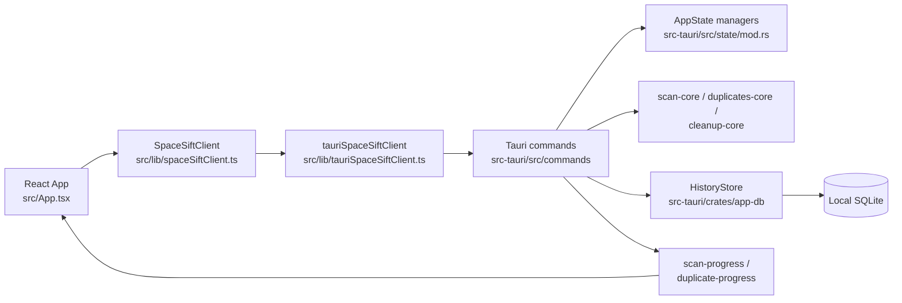
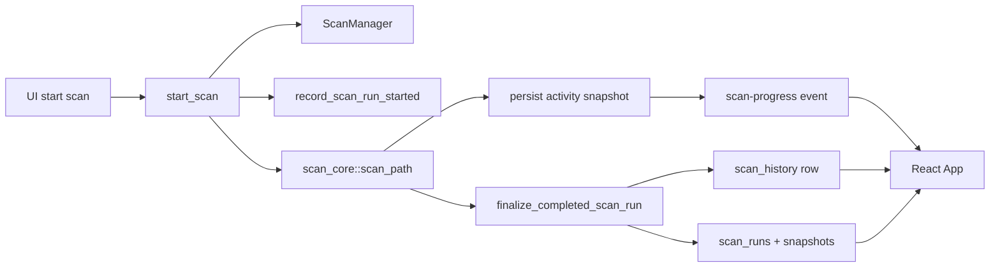

# Space Sift Project Map

## Purpose and scope

This map describes the repository as it exists today. It focuses on the shipped desktop app, the Rust and TypeScript module boundaries, the local persistence model, test and CI layout, and the docs that currently govern work.

This map does not restate full feature contracts from `specs/`, does not propose a future architecture, and does not replace the more detailed plan, spec, ADR, or architecture artifacts already in `docs/` and `specs/`.

Observed facts are stated directly. Where a conclusion is reasoned from the current code shape rather than stated in docs, it is marked as an inference.

## System overview

The repository is a single Windows desktop app with one frontend, one Tauri host, and several Rust workspace crates:

- Frontend app: React + TypeScript + Vite in `src/`, bootstrapped by `src/main.tsx` and rendered through `src/App.tsx`.
- Frontend-to-backend boundary: `src/lib/spaceSiftClient.ts` defines the typed app interface; `src/lib/tauriSpaceSiftClient.ts` adapts that interface to Tauri `invoke` calls and event listeners.
- Desktop shell: `src-tauri/src/main.rs` and `src-tauri/src/lib.rs` start Tauri, initialize the SQLite store, reconcile and purge persisted scan runs, and register the command surface.
- Tauri command layer: `src-tauri/src/commands/` exposes scan, history, duplicate, cleanup, privileged-capability, and Explorer-handoff commands.
- Runtime state layer: `src-tauri/src/state/mod.rs` keeps in-memory runtime managers for the active scan, active duplicate analysis, and latest cleanup preview or execution.
- Rust domain crates:
  - `src-tauri/crates/scan-core/`: recursive scanning, progress snapshots, completed scan payloads, run continuity types, and scan measurement helpers.
  - `src-tauri/crates/duplicates-core/`: duplicate candidate verification, staged hashing, progress reporting, and hash-cache abstractions.
  - `src-tauri/crates/cleanup-core/`: cleanup rule loading, preview construction, execution, and validation.
  - `src-tauri/crates/app-db/`: SQLite schema, history persistence, scan-run continuity persistence, duplicate hash cache, and cleanup execution persistence.
  - `src-tauri/crates/elevation-helper/`: protected-path detection and capability messaging.
- Governance and delivery:
  - `specs/` holds the current behavior contracts and test specs.
  - `docs/plans/`, `docs/architecture/`, and `docs/adr/` hold approved delivery and architecture context.
  - `.github/workflows/` plus `scripts/` implement CI and release automation.
  - `winget/` contains the checked-in Windows Package Manager manifests for the current version.

## Repository layout

| Path | Responsibility |
| --- | --- |
| `src/main.tsx` | Frontend entry point; renders `App` with the Tauri-backed client. |
| `src/App.tsx` | Main UI surface for scan start, run/history review, results explorer, duplicate review, and cleanup. |
| `src/lib/spaceSiftTypes.ts` | Shared TypeScript shapes mirroring the Rust serde contracts returned across Tauri. |
| `src/lib/spaceSiftClient.ts` | Typed frontend service contract, idle defaults, and unsupported fallback client. |
| `src/lib/tauriSpaceSiftClient.ts` | Concrete Tauri `invoke` and event adapter. |
| `src/config/cleanup-rules/` | TOML cleanup rules embedded into `cleanup-core` with `include_str!`. |
| `src/*.test.tsx`, `src/*.test.ts` | Frontend and release-config tests, colocated with the UI app. |
| `src/test/setup.ts` | Vitest and Testing Library setup. |
| `src-tauri/src/lib.rs` | Tauri setup, DB initialization, startup reconciliation, purge, and command registration. |
| `src-tauri/src/commands/` | Thin-to-medium orchestration layer between Tauri, runtime managers, persistence, and domain crates. |
| `src-tauri/src/state/mod.rs` | In-memory managers for live scan state, duplicate analysis state, and cleanup preview or execution state. |
| `src-tauri/crates/scan-core/` | Scan algorithm, result models, progress snapshots, and measurement utilities. |
| `src-tauri/crates/duplicates-core/` | Duplicate verification, staged hashing, progress snapshots, and cache protocol. |
| `src-tauri/crates/cleanup-core/` | Cleanup preview and execution domain logic plus built-in rule loading. |
| `src-tauri/crates/app-db/` | SQLite schema and repository methods for scans, runs, cache, and cleanup execution history. |
| `src-tauri/crates/elevation-helper/` | Protected-path capability and path classification helpers. |
| `docs/plan.md`, `docs/plans/` | Active, blocked, done, and superseded execution-plan index and plan bodies. |
| `docs/architecture/`, `docs/adr/` | Architecture notes and ADRs; `CONSTITUTION.md` now requires `draft`, `approved`, or `superseded` status values. |
| `docs/proposals/`, `docs/explain/` | Proposal artifacts and post-change rationale. |
| `specs/` | Feature specs and matching test specs. |
| `scripts/` | CI script, release verification, Windows signing, and release-config generation. |
| `.github/workflows/` | GitHub Actions CI and release pipelines. |
| `winget/` | Versioned `winget` manifests for the current app version. |
| `tests/fixtures/` | Currently only a placeholder `.gitkeep`; no active shared fixture corpus exists yet. |

## Runtime flow

### App startup

- Frontend startup is `src/main.tsx -> App`.
- Backend startup is `src-tauri/src/main.rs -> space_sift_lib::run() -> src-tauri/src/lib.rs`.
- During Tauri setup, the app:
  - resolves the app data directory and SQLite path via `history_db_path()`;
  - constructs `app_db::HistoryStore`;
  - runs `initialize()`, `reconcile_scan_runs()`, and `purge_expired_scan_runs()`;
  - stores `AppState` in Tauri-managed state;
  - registers the Tauri command surface.

### Scan flow

Observed flow:

1. The UI calls `client.startScan()` from `src/App.tsx`.
2. `src/lib/tauriSpaceSiftClient.ts` invokes `start_scan`.
3. `src-tauri/src/commands/scan.rs` starts the in-memory scan via `ScanManager`, records the run header and initial snapshot in SQLite through `HistoryStore`, and emits an initial `scan-progress` event.
4. The scan runs on a blocking worker via `scan_core::scan_path()`.
5. Progress callbacks persist run snapshots, update `ScanManager`, and emit `scan-progress`.
6. A heartbeat loop in `src-tauri/src/commands/scan.rs` persists synthetic liveness snapshots when work is quiet.
7. On success, `HistoryStore::finalize_completed_scan_run()` writes the completed scan payload and terminal continuity state in one repository path.
8. The frontend reacts to the terminal snapshot, reopens the saved scan via `openScanHistory`, and refreshes history and run summaries.

### Duplicate-analysis flow

- `start_duplicate_analysis` reopens the selected completed scan from SQLite, filters file entries only, and builds a `DuplicateAnalysisRequest`.
- `DuplicateManager` tracks the live in-memory status while `duplicates_core::analyze_duplicates()` runs in a blocking worker.
- Progress events are emitted on the `duplicate-progress` channel.
- The completed duplicate analysis is stored in `DuplicateManager.latest_result`, not in SQLite.

Inference:

- Duplicate analysis results are currently session-scoped. They can be reopened during the same app session through `open_duplicate_analysis`, but they are not restored from persistent storage after restart.

### Cleanup flow

- `preview_cleanup` reopens the current completed scan from SQLite, converts file entries into a `CleanupPreviewRequest`, adds duplicate delete paths and enabled rule IDs, and calls `cleanup_core::build_cleanup_preview()`.
- Built-in cleanup rules come from `src/config/cleanup-rules/*.toml` and are compiled into `cleanup-core`.
- The generated preview is stored in `CleanupManager.latest_preview`.
- `execute_cleanup` reopens that preview from memory, calls `cleanup_core::execute_cleanup()` with `SystemCleanupExecutor`, saves the execution result to SQLite, and stores the latest execution in memory.

Inference:

- Cleanup previews are session-scoped in memory, while cleanup execution results are durably persisted in SQLite.

### Non-live run actions and Explorer handoff

- `list_scan_runs` and `open_scan_run` read continuity summaries and paged snapshot previews from SQLite.
- `cancel_scan_run` delegates active-run cancellation to `ScanManager`; non-live cancellations are appended in SQLite by `HistoryStore::cancel_non_live_scan_run()`.
- `resume_scan_run` is wired end-to-end, but `scan_core::SCAN_RESUME_ENGINE_SUPPORTED` is currently `false`, so the command always returns an explicit machine-readable rejection.
- `open_path_in_explorer` is a Windows-only shell integration that validates existence and then spawns `explorer.exe`.

## Data flow

### Main persisted entities

Observed in `src-tauri/crates/app-db/src/lib.rs`:

- `scan_history`: completed scan payloads stored as `scan_json` plus summary columns.
- `scan_runs`: the latest header state for each run.
- `scan_run_snapshots`: append-only ordered run snapshots.
- `scan_run_audit`: reconciliation, cancel, resume-rejection, and purge audit rows.
- `duplicate_hash_cache`: persisted partial and full hashes keyed by path, size, and modified time.
- `cleanup_execution_history`: persisted cleanup execution payloads.

### Main in-memory entities

Observed in `src-tauri/src/state/mod.rs`:

- `ScanManager` holds the current UI scan snapshot plus runtime heartbeat and sequencing state.
- `DuplicateManager` holds the current duplicate-analysis snapshot and the latest completed analysis result.
- `CleanupManager` holds the latest preview and latest execution result for the current session.

### Serialization boundaries

- Rust serde structs in `scan-core`, `duplicates-core`, `cleanup-core`, and `elevation-helper` are mirrored by TypeScript types in `src/lib/spaceSiftTypes.ts`.
- The frontend does not call Tauri directly from the main component; it depends on the `SpaceSiftClient` interface, then uses `tauriSpaceSiftClient` as the concrete adapter.
- The repository uses camelCase JSON fields at the Tauri boundary for most externally consumed payloads.

### Data ownership summary

- Scan discovery and completed scan models: `scan-core`.
- Duplicate verification and hash-cache protocol: `duplicates-core`.
- Cleanup preview and execution rules: `cleanup-core`.
- Durable storage and continuity reconciliation: `app-db`.
- UI orchestration and view state: `src/App.tsx`.

## External boundaries

- Platform baseline: Windows 11 desktop; the repo and specs treat this as the primary supported target.
- Desktop runtime: Tauri 2 with WebView2 bootstrapper configuration in `src-tauri/tauri.conf.json`.
- Filesystem and shell boundaries:
  - scanning is local filesystem traversal in `scan-core`;
  - cleanup uses the `trash` crate for Recycle Bin deletes and `std::fs::remove_file` for permanent delete;
  - Explorer handoff uses `explorer.exe`.
- Database boundary: local SQLite via `rusqlite`, with the database created under the app data directory.
- Release automation boundary:
  - CI: `.github/workflows/ci.yml` runs `scripts/ci.ps1` under PowerShell;
  - release: `.github/workflows/release.yml` runs `bash scripts/release-verify.sh`, validates signing secrets, generates `src-tauri/tauri.release.conf.json`, and invokes `tauri-apps/tauri-action@v0`.
- Distribution boundary: `winget/manifests/x/xiongxianfei/SpaceSift/0.1.0/`.

## Test map

- Frontend tests:
  - `src/App.test.tsx`: shell, branding, and safety messaging.
  - `src/scan-history.test.tsx`: active scan flow, history ordering, loaded-result behavior, and run continuity UI.
  - `src/results-explorer.test.tsx`: drill-down explorer behavior, breadcrumb navigation, sorting, and Explorer handoff.
  - `src/duplicates.test.tsx`: duplicate analysis lifecycle, keep-selection helpers, disclosure state, and review readability.
  - `src/cleanup.test.tsx`: cleanup preview, recycle-first execution, and permanent-delete gating.
  - `src/release-config.test.ts`: repository release metadata and workflow invariants.
- Frontend test setup: `src/test/setup.ts`.
- Rust unit and integration-style tests live inline in:
  - `src-tauri/src/state/mod.rs`
  - `src-tauri/src/commands/history.rs`
  - `src-tauri/src/commands/scan.rs`
  - `src-tauri/crates/scan-core/src/lib.rs`
  - `src-tauri/crates/duplicates-core/src/lib.rs`
  - `src-tauri/crates/cleanup-core/src/lib.rs`
  - `src-tauri/crates/app-db/src/lib.rs`
  - `src-tauri/crates/elevation-helper/src/lib.rs`
- Performance-oriented manual harnesses exist in:
  - `src-tauri/crates/scan-core/examples/measure_scan.rs`
  - `src-tauri/crates/duplicates-core/examples/measure_duplicates.rs`
- Observed gap:
  - there is no separate browser E2E suite, Tauri desktop automation suite, or active shared fixture corpus under `tests/fixtures/`.

## CI/release map

- Local build and verification commands from repo docs and scripts:
  - `npm install` for local bootstrap
  - `npm run lint`
  - `npm run test`
  - `npm run build`
  - `cargo check --manifest-path src-tauri/Cargo.toml`
  - `npm run tauri dev`
  - `powershell -NoLogo -NoProfile -ExecutionPolicy Bypass -File scripts/ci.ps1`
  - `bash scripts/release-verify.sh`
- `scripts/ci.ps1` is the canonical CI-parity script and runs `npm ci`, lint, test, build, and Cargo check.
- `scripts/ci.sh` remains as a compatibility wrapper that delegates to the PowerShell script when a Windows PowerShell host is available.
- `scripts/release-verify.sh` verifies:
  - clean working tree
  - version alignment across `package.json`, `src-tauri/Cargo.toml`, `src-tauri/tauri.conf.json`, and `winget/`
  - release workflow and docs presence
  - updater and signing configuration expectations
- `scripts/write-tauri-release-config.mjs` generates `src-tauri/tauri.release.conf.json` from `TAURI_UPDATER_PUBLIC_KEY`.
- `docs/release.md` is the current human runbook for the public release path.

## Architecture rules observed

- The frontend is intentionally isolated behind a typed `SpaceSiftClient` interface instead of hard-coding Tauri calls inside the UI.
- Durable user-facing data is local-first and SQLite-backed.
- Live progress is event-driven (`scan-progress`, `duplicate-progress`), while durable reopen flows use command reads.
- The main product safety boundaries fail closed:
  - protected-path cleanup capability is reported as unavailable by default;
  - cleanup execution is preview-first and defaults to Recycle Bin mode;
  - scan resume is exposed explicitly but remains disabled by engine capability.
- Feature and lifecycle governance are artifact-driven: plans, specs, test specs, architecture docs, ADRs, and workflow docs are all present and actively used.

## Risk areas

- `src/App.tsx` is the single UI orchestration file for nearly every visible workflow and is currently about 1,788 lines. Ownership is centralized, but state and view concerns for scanning, history, explorer, duplicates, and cleanup are tightly coupled there.
- `src-tauri/src/commands/scan.rs` is currently about 1,470 lines and combines Tauri command entry points, heartbeat scheduling, persistence coordination, event emission, audit logging, and error translation.
- `src-tauri/crates/app-db/src/lib.rs` is currently about 3,519 lines and mixes schema creation, scan history persistence, scan-run continuity, duplicate hash caching, cleanup execution persistence, and many repository tests.
- Duplicate analysis results and cleanup previews are held in memory in `DuplicateManager` and `CleanupManager`. Inference: these flows are more restart-fragile than completed scan history and scan-run continuity.
- Release readiness is well documented, but the final public release path still depends on external secrets, tag discipline, manual `winget` hash refresh, and Windows signing infrastructure.
- The repo has strong unit and UI integration-style coverage, but there is no observed end-to-end desktop automation layer that drives the real Tauri shell on CI.

## Open questions

- Is duplicate-analysis persistence intentionally session-only, or is durable reopen expected in a later milestone?
- `app-db` persists cleanup execution history, but the current command and UI surface does not appear to expose that history back to the user. Is that storage present only for audit durability right now?
- Should additional approved architecture notes exist for the scan, duplicate, cleanup, and release subsystems, or is the current single approved architecture note intended to cover only run continuity?
- `tests/fixtures/` is currently only a placeholder. Is a shared fixture corpus expected later for filesystem-heavy integration tests?
